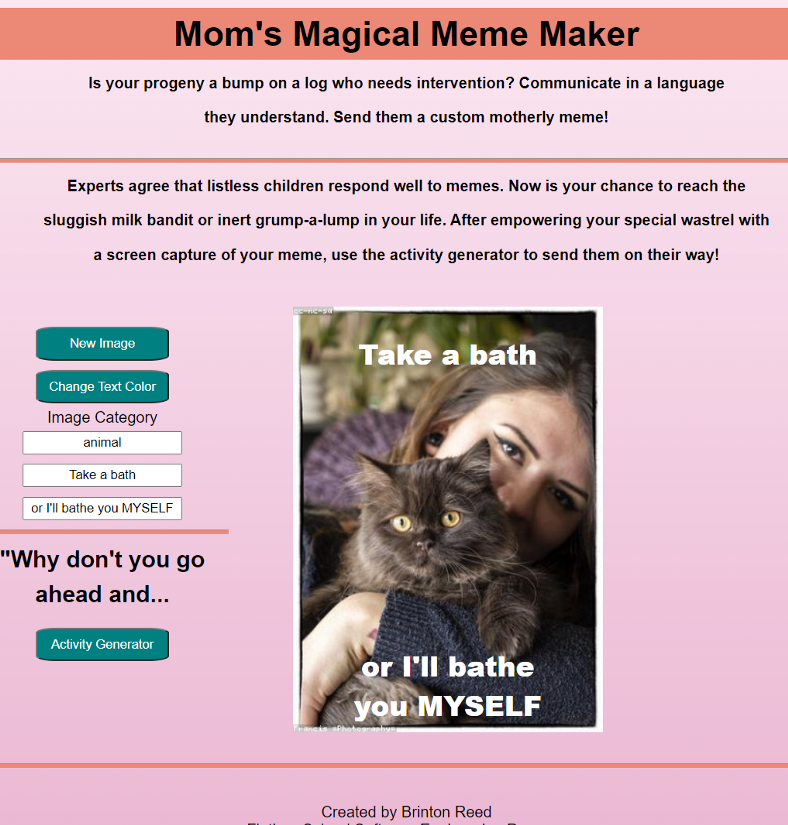
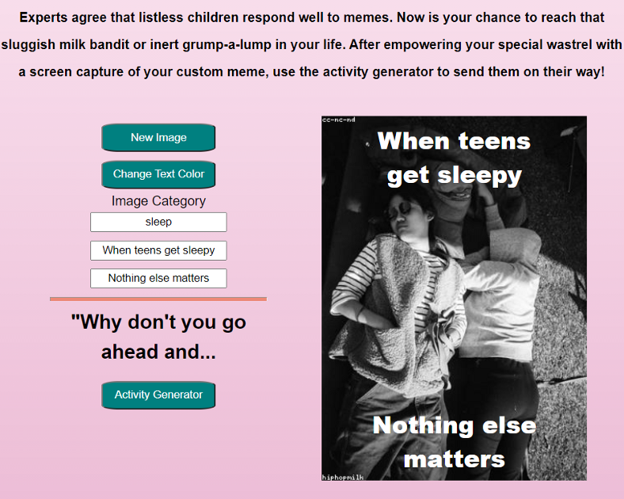
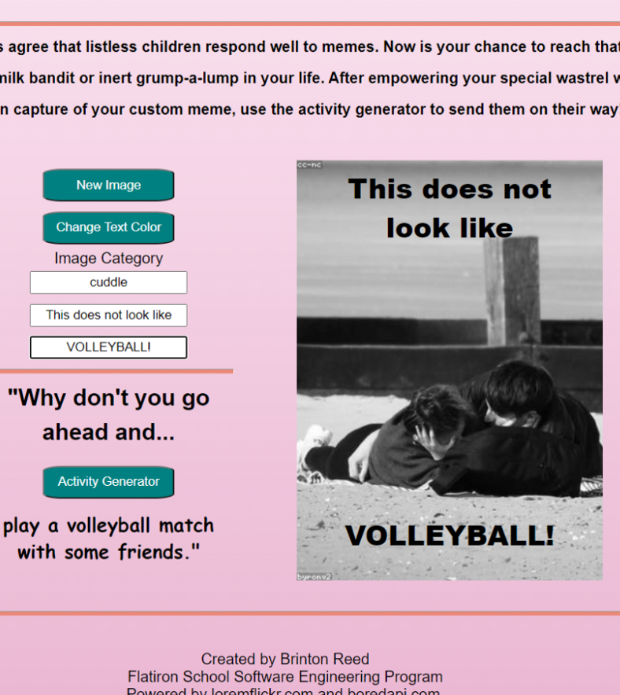

Magical Meme Maker for Moms


See the working app and [create a mom meme today!](https://bfreed76.github.io/Magical-Meme-Maker-for-Moms/)

 
<p align="center">

</p>

## Description

This app uses vanilla Javascript, HTML and CSS to create an meme maker and random activity generator for moms with lazy kids! 

### Built Using

&nbsp;&nbsp;&nbsp;
&nbsp;&nbsp;
&nbsp;&nbsp;

<p align="center">

</p>

<!-- CONTACT -->
## Contact Me

[](https://www.linkedin.com/in/brintonfoyreed/) [](https://www.instagram.com/nigels_vacation/) [](https://brintonfoyreed.medium.com/)[ ](mailto:brintonfoyreed@gmail.com)

Project Link: [Meme Maker for Moms](https://bfreed76.github.io/Magical-Meme-Maker-for-Moms/)

<a href="https://github.com/bfreed76">
<strong>See more apps on my profile page »</strong></a>

<p align="center">

</p>

## Setup

To setup on your machine, simply navigate to this project's parent directory and clone this repo using the command line.
```
git clone git@github.com:bfreed76/Magical-Meme-Maker-for-Moms.git
```
Once the project is cloned on to your local machine, navigate to the parent folder and open up the index.html file in a browser. 

